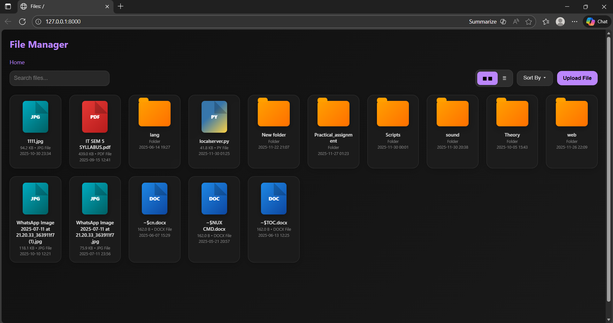
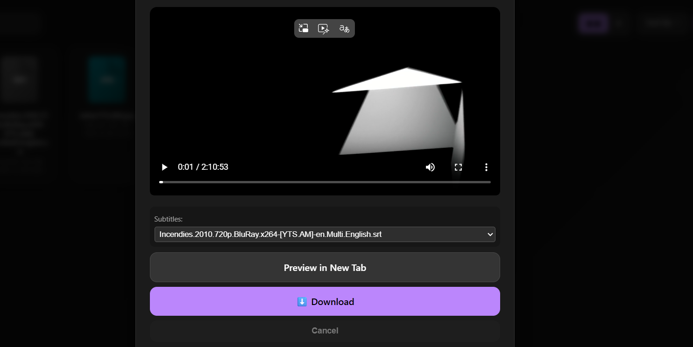
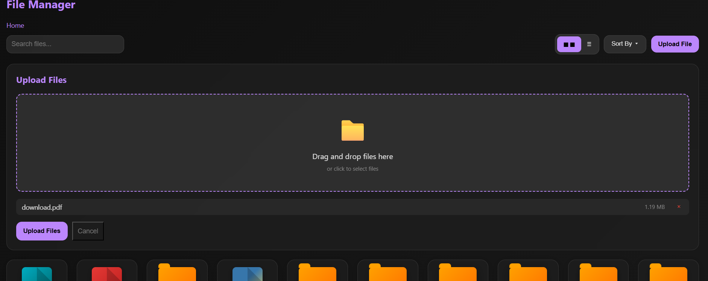

# HTTP Hosting

This script provides a local HTTP server built on Python's http.server module. It is designed for sharing files quickly and safely across a local network.
### What it does:

- Creates a small local website on your computer using Python. When you run it, your computer becomes a mini web server that lets you share files with anyone on the same **Wi-Fi or LAN network, not the internet.**
- This makes it a quick and safe way to share files with multiple devices without needing email, USB drives, or cloud services.
  
---

## ✅ Compatibility

### **Works on:** **Windows, macOS, and Linux.**
  
## Features:

* Share selected folder on a clean interface.
* **Preview** for images, audio, and video.
* **External Subtitles** support.
* **Download and Upload** files easily. 
* Console **QR code** for quick mobile access.

---

## Download📥 (Windows-Only) (No Setup Required) 

You can simply download the standalone application:

1.  Go to the **[Releases Page](https://github.com/Kartik-gawd/HTTP_Hosting/releases/tag/v1.1)**.
2.  Download `launcher.exe`.
3.  Double-click to run.
   
---

## How to Setup

### 1. Requirements

- Python 3.x.
- **For Linux**, install **tkinter**. (Built-in for Windows and macOS)
- (Optional) Install **segno** (QR code dependency):

```bash
pip install segno
```

> If skipped, the script runs normally but without QR code display.

---

### 2. Run the Server

In the code folder, run `launcher.py` using:

```bash
python launcher.py
```
or by running it through any IDE.

A window will pop up. Select the folder you want to serve.

---

### 3. Access the Server

The console/terminal will show:

```
============================================================
SERVER STARTING...
Port: 8000
Local URL: http://127.0.0.1:8000
Network URL: http://192.168.1.10:8000

# ... QR Code Image will appear here (if segno is installed)

Press Ctrl+C to stop the server
============================================================
```

Open one of the URLs in your browser to access the file manager.

---

## Screenshots

### Interface


### Preview


### Upload


## Configuration (config.py)
You can modify config.py to change server behavior:
- **PORT**: Change the default port (8000).
- **MAX_UPLOAD_MB**: Set the maximum file upload size (Default: 5GB). Ensure theres enough space in host machine.
- **EXCLUDED_EXTENSIONS**: Hide specific file types from the web view.
- **IPs allow/block**: /Removed/
  
---

## Future enhancement (what it lacks)

- ### HTTPS (Impossible, but session cookies can be implemented).
- ### Embedded Audio-tracks and soft subtitles support (Requires a Media player using ffmpeg)
- ### Folder download as zip
- ### Clipboard feature
- ### RAM killing uploads on large files (fixed, yet to upload)

---

# ⚠️ SECURITY WARNING: DO NOT USE FOR PRODUCTION OR SENSITIVE DATA
**IF port forwarding is enabled** for this port (port: 8000), it will make your local server **reachable** from the **public internet**. That means anyone outside your network could access it with your **public ip**, so it’s only meant for testing and debugging.

Anyone monitoring the network connection (e.g., MITM attackers, public Wi-Fi sniffers, or your ISP) can read and intercept all information.
- Make sure port forwarding for the port the script is using (port 8000) is **turned OFF**.
- NEVER run this server as the root or Administrator user.

## On the positive side:

Home routers usually have **port forwarding off by default** for safety so the typical LAN isolation on home routers prevents external attacks. For local testing, this setup is generally safe as long as you trust the devices on your network and avoid handling sensitive data.

---

## ⚖️ License

This project is licensed under the **MIT License** - see the **[LICENSE](LICENSE)** file for details.

## Contributing

Feel free to submit pull requests or raise issues on the GitHub repository!
