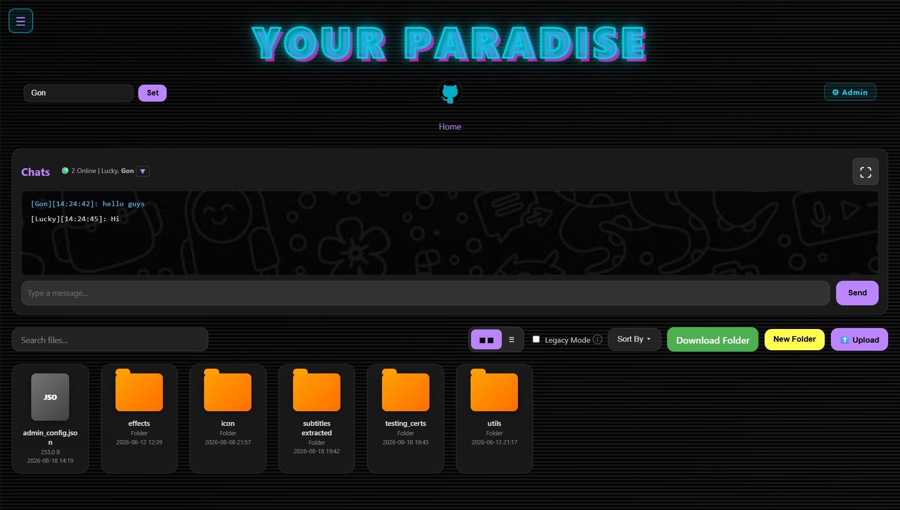
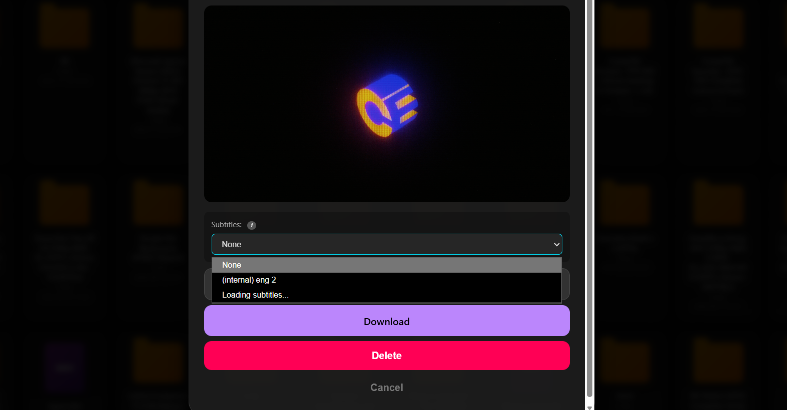
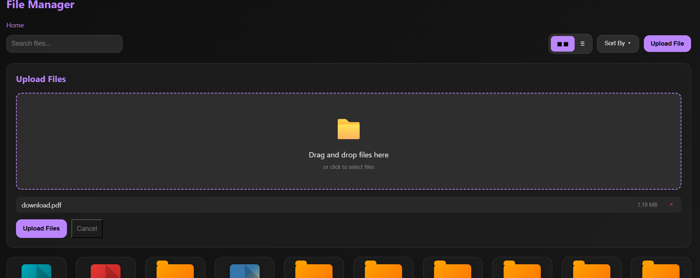
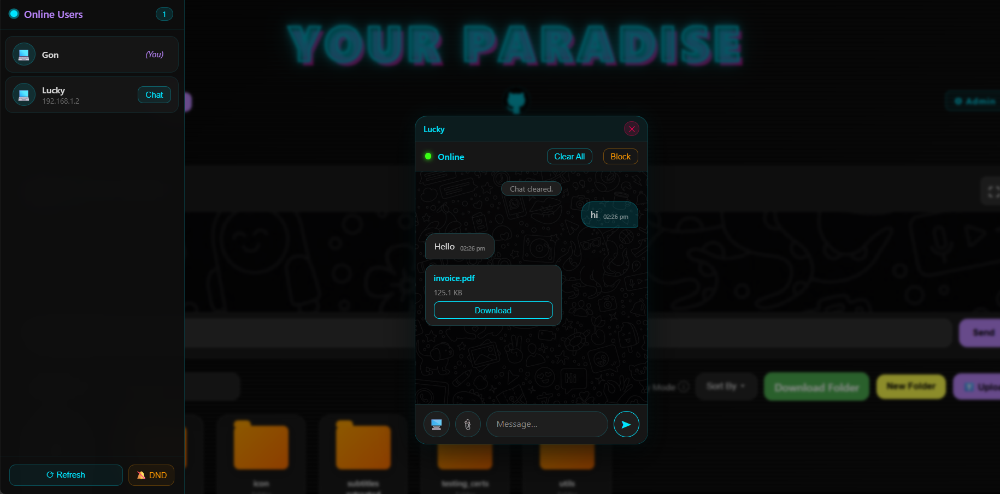
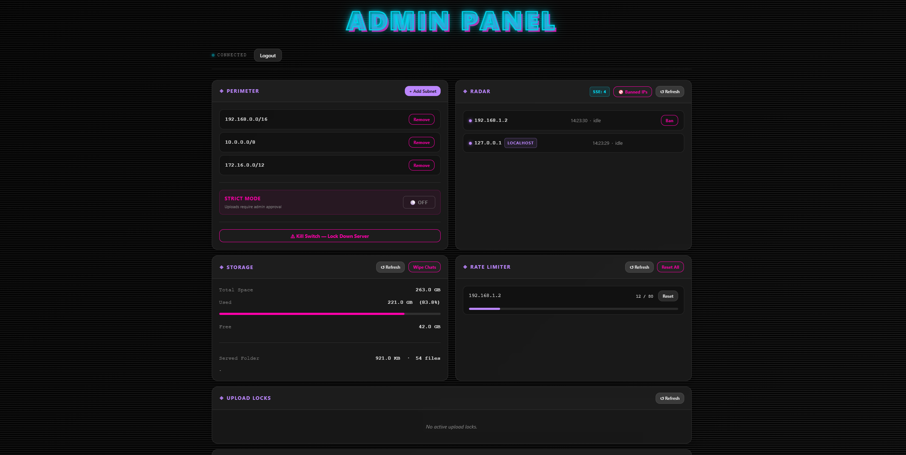

# HTTP Hosting

A lightweight, self-hosted **LAN file and media server** built with Python's `http.server`.

Share a folder with devices on the same Wi-Fi or LAN network through a clean web interface — with media previews, subtitles, uploads, global chat, WebRTC P2P features, and an administration console.

> **LAN only:** This project is designed for local network sharing and is not intended to expose your files directly to the public internet.


### Compatibility: **Windows · macOS · Linux**

## Features:

* Share selected folder on a clean interface.
* **Preview** images, audio, and video with **External + Internal Subtitles** support.
* **Legacy Player Mode** for older devices.
* **Download and Upload** files easily.
* **Global Chat** for everyone connected.
* **P2P Communication** — private chat, file transfer, and screen sharing between connected users.
* **Admin Controls** — user management, upload moderation, network access controls.
* **QR Code + LAN Discovery** for easy connection.
* **HTTPS Support** for secure connections.
* **Cross-platform** support for Windows, macOS, and Linux.
* **Standalone Windows EXE** available with no installation required.

  
# Windows Download  📥

**No installation required.**

1. Go to the [Releases Page](https://github.com/Kartik-gawd/Your-Paradise/releases/tag/V2.0).
2. Download `YP-server-(HTTP).exe`.
3. Double-click the executable.
4. Allow network access if Windows Firewall asks.
5. Select the folder you want to share.


# Running From Source

## Requirements

- Python 3.x
- Tkinter
  - Windows: normally included with Python
  - macOS: normally included
  - Linux: install your distribution's Tkinter package
- FFmpeg for internal subtitle extraction.
- Optional:
  - `segno` — QR code generation
  - `zeroconf` — LAN/mDNS discovery

Install optional Python dependencies:

```bash
pip install segno zeroconf ffmpeg-python
````

Make sure the **FFmpeg executable** is available in your system `PATH` if you want embedded subtitle extraction.

---

## Starting the Server:

From the project directory:

```bash
python launcher.py
```

You can also launch it through an IDE.

A folder-selection window will appear. Select the directory you want to serve.

The console will display something similar to:

```text
============================================================
SERVER STARTING...
Port: 8000
Local URL: http://127.0.0.1:8000
Network URL: http://192.168.1.10:8000

# QR Code will appear here if enabled

Press Ctrl+C to stop the server
============================================================
```

Open the displayed **Network URL** from another device connected to the same Wi-Fi/LAN.


# Screenshots

### Interface



### Media Preview



### Upload



### P2P



### Admin



# Configuration

Available through `config.py`. You can customize:

| Option                | Description                                   |
| --------------------- | --------------------------------------------- |
| `PORT`                | Default server port (`8000`)                  |
| `MAX_UPLOAD_MB`       | Maximum upload size                           |
| `EXCLUDED_EXTENSIONS` | File extensions hidden from the web interface |

etc.
---

# Note about Network Access

The server is intended for **trusted local networks**.
If the program starts successfully but other devices cannot open the webpage while the host computer can, check your firewall.
Make sure the firewall allows the Python server / packaged executable to accept connections on the configured port.

# 🔒 Security Note

This application is designed primarily for sharing files across a trusted LAN.
Do not expose the server directly to the public internet without understanding and configuring the required network and security controls.

# ⚖️ License

This project is licensed under the **MIT License**.

See [LICENSE](LICENSE) for details.
